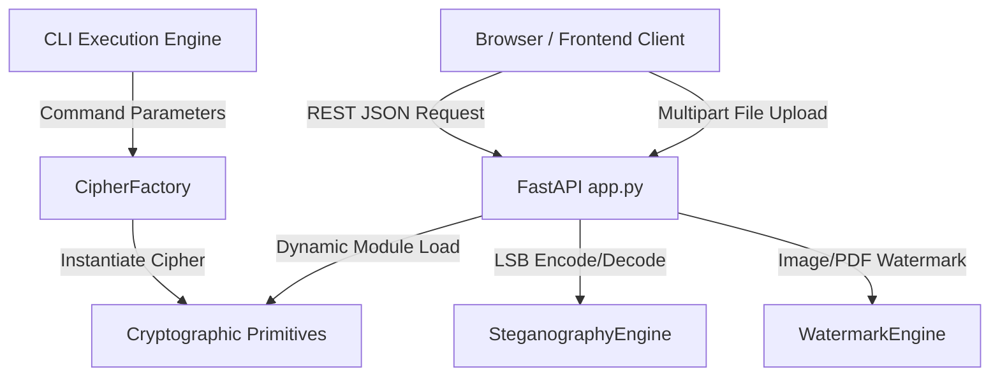

# Pre-SAST Codebase Assessment: Data Privacy & Forensics Toolkit (DPFT)

This document provides a comprehensive pre-SAST codebase assessment of the Data Privacy & Forensics Toolkit (DPFT). It maps the architecture, APIs, sensitive assets, trust boundaries, and security controls, and ranks the files of greatest concern for the upcoming SAST scan.

---

## 1. Executive Summary

*   **Purpose of the Application:** 
    The Data Privacy & Forensics Toolkit (DPFT) is a localized, full-stack security and forensic utility designed to execute cryptographic operations, digital forensics, and media processing. It aims to provide a localized, zero-trust sandbox where all operations are executed in-memory.
*   **Main Business Functionality:**
    *   **Cryptographic Processing:** Implements a library of 20+ cryptographic primitives (symmetric ciphers, stream ciphers, asymmetric systems, and hashing/KDF functions) exposed via a web API and Command Line Interface (CLI).
    *   **Steganography:** Embeds and extracts secret text payloads inside PNG images using Least Significant Bit (LSB) substitution.
    *   **Watermarking:** Applies visible, diagonal text watermarks to uploaded images and PDF documents dynamically.
*   **Target Users:**
    *   Security researchers and cryptographic engineers evaluating primitive behavior.
    *   Digital forensic analysts wishing to watermark assets or extract LSB payloads.
    *   Educational users exploring classical and modern cryptography in a sandbox environment.

---

## 2. Technology Stack

*   **Frontend Technologies:**
    *   HTML5 (semantic structure)
    *   CSS3 (custom styles for spatial UI, glassmorphism, 3D tilt effects)
    *   Tailwind CSS (utility classes loaded via CDN)
    *   Lucide Icons (SVG icon rendering library loaded via CDN)
    *   Vanilla ES6+ JavaScript (DOM orchestration and network layer)
*   **Backend Technologies:**
    *   Python 3.10+
    *   FastAPI (web framework/routing)
    *   Uvicorn (ASGI server implementation)
*   **Programming Languages:**
    *   Python (backend logic)
    *   JavaScript (frontend logic)
*   **Frameworks:**
    *   FastAPI (backend)
*   **Libraries:**
    *   `pycryptodome` (cryptographic operations: AES, Blowfish, DES, RSA, SHA-3, KDFs)
    *   `twofish` (declared in requirements, though not directly integrated in current algorithms)
    *   `Pillow` (image loading, LSB manipulation, and watermarking canvas creation)
    *   `pypdf` & `reportlab` (PDF document reading, canvas composition, and content-stream merging)
    *   `python-multipart` (multipart form-data parsing for file uploads)
*   **Build Tools & Package Managers:**
    *   Python `pip` (dependency installation)
    *   Python `venv` (local package isolation)
    *   No frontend bundlers or package managers (static assets served directly)

---

## 3. Project Structure

The codebase is split into two primary layers: a static frontend and a Python-based FastAPI backend, accompanied by a test suite.

### Major Folders
*   [`backend/`](file:///d:/data-privacy-toolkit/backend): Contains all server logic, API endpoints, and processing engines.
    *   [`backend/algorithms/`](file:///d:/data-privacy-toolkit/backend/algorithms): Library of ciphers, hashing functions, and key utility modules.
    *   [`backend/steganography/`](file:///d:/data-privacy-toolkit/backend/steganography): Contains the LSB steganography core engine.
    *   [`backend/watermarking/`](file:///d:/data-privacy-toolkit/backend/watermarking): Contains image and PDF watermarking engines.
*   [`frontend/`](file:///d:/data-privacy-toolkit/frontend): Contains static client assets.
    *   [`frontend/css/`](file:///d:/data-privacy-toolkit/frontend/css): Holds UI visual styling sheets.
    *   [`frontend/js/`](file:///d:/data-privacy-toolkit/frontend/js): Houses the frontend execution scripts.
*   [`tests/`](file:///d:/data-privacy-toolkit/tests): Python unit tests targeting individual ciphers, CLI behavior, and media engines.

### Important Files
*   [`backend/app.py`](file:///d:/data-privacy-toolkit/backend/app.py): The main FastAPI application defining REST routes, CORS policies, and the dynamic cryptographic dispatch handler.
*   [`backend/cli.py`](file:///d:/data-privacy-toolkit/backend/cli.py): Command Line Interface parser allowing standalone execution of algorithms.
*   [`backend/algorithms/factory.py`](file:///d:/data-privacy-toolkit/backend/algorithms/factory.py): Centralized registry mapping algorithm string aliases to Python cipher classes.
*   [`run.py`](file:///d:/data-privacy-toolkit/run.py): The entry script to start the FastAPI server via Uvicorn.
*   [`frontend/index.html`](file:///d:/data-privacy-toolkit/frontend/index.html): The HTML canvas presenting the spatial UI and the sidebar algorithm navigator.
*   [`generate_map.py`](file:///d:/data-privacy-toolkit/generate_map.py): Script generating ASCII project structures.

### Entry Points
*   **Web Server Entry Point:** [`run.py`](file:///d:/data-privacy-toolkit/run.py) (starts the ASGI server pointing to `backend.app:app`).
*   **CLI Entry Point:** [`backend/cli.py`](file:///d:/data-privacy-toolkit/backend/cli.py) (invoked via `python -m backend.cli`).
*   **Frontend Entry Point:** [`frontend/index.html`](file:///d:/data-privacy-toolkit/frontend/index.html) (opened locally in the browser).

---

## 4. Application Architecture

*   **High-Level Architecture:**
    The application follows a client-server architecture with a stateless API layer. The UI runs on the client browser and uses asynchronous HTTP requests to interact with the backend FastAPI application. Dynamic module loading allows the backend to dynamically import and instantiate cipher classes on demand.
*   **Data Flow:**
    *   **Cryptographic Text Operations:** Client inputs plaintext, key, and optional variables -> sent via POST to `/api/crypto/{action}/{algorithm}` -> backend dynamically imports `backend.algorithms.{algorithm}_cipher` -> locates the corresponding cipher class -> calls `encrypt` or `decrypt` -> returns the base64-encoded or raw result in JSON.
    *   **Media Forensics:** Client uploads a file (image or PDF) and a text payload -> sent via multipart POST to `/api/stego/...` or `/api/watermark/...` -> backend reads the file into memory as a byte stream -> processes it using `Pillow` or `pypdf` -> returns raw modified binary bytes back to the browser -> client initiates an automatic file download.
*   **Authentication Flow:**
    *   **Absent.** The application exposes all routes publicly. There is no user login verification, API key requirement, or signature validation for API requests.
*   **Authorization Model:**
    *   **Absent.** All operations are performed at the same privilege level. There are no roles or access restrictions.
*   **Session Management Approach:**
    *   **Absent.** The backend is stateless. Although `frontend/index.html` displays a visual mockup of a session token (`SESSION_TOKEN: 8xFD-2200-LL91`), no sessions are actually generated, verified, or tracked on the backend server.

---

## 5. Database Analysis

*   **Database Type:**
    *   **None.** The application does not connect to any SQL or NoSQL database. It runs in-memory and keeps no persistent state across API requests.
*   **ORM Usage:** None.
*   **Models/Entities:**
    *   Pydantic schemas `CipherRequest` and `CipherResponse` are defined in [`backend/app.py`](file:///d:/data-privacy-toolkit/backend/app.py) for API payload parsing and validation.
*   **Database Connection Handling:** None.
*   **Migration Mechanism:** None.
*   *Note on key_vault.py:*
    The file [`backend/algorithms/key_vault.py`](file:///d:/data-privacy-toolkit/backend/algorithms/key_vault.py) implements an encrypted file storage model using a local JSON file (`vault.json`) with AES-256-GCM. However, this is treated as a standalone cryptographic algorithm module and is not used by the web app's active endpoints.

---

## 6. API Inventory

All API endpoints are hosted by FastAPI in [`backend/app.py`](file:///d:/data-privacy-toolkit/backend/app.py).

| Endpoint | HTTP Method | Purpose | Authentication | Input Parameters | Output Structure |
| :--- | :--- | :--- | :--- | :--- | :--- |
| `/api/crypto/{action}/{algorithm}` | `POST` | Dynamically executes encryption or decryption for a chosen algorithm. | None | **Path:** `action` (string: "encrypt"/"decrypt"), `algorithm` (string). **Body (JSON):** `text` (str), `key` (str), `position` (int, default 0), `nonce` (str, default null). | JSON: `{"result": "<output_string>"}` |
| `/api/stego/encode` | `POST` | Hides secret text in an uploaded image using LSB steganography. | None | **Multipart Form:** `file` (UploadFile), `secret_text` (Form string). | Binary stream (`image/png`) |
| `/api/stego/decode` | `POST` | Extracts hidden text from an uploaded LSB steganographic image. | None | **Multipart Form:** `file` (UploadFile). | JSON: `{"secret_text": "<decoded_payload>"}` |
| `/api/watermark/image` | `POST` | Applies a diagonal text watermark to an uploaded image. | None | **Multipart Form:** `file` (UploadFile), `text` (Form string). | Binary stream (`image/png`) |
| `/api/watermark/pdf` | `POST` | Applies a diagonal text watermark to all pages of an uploaded PDF. | None | **Multipart Form:** `file` (UploadFile), `text` (Form string). | Binary stream (`application/pdf`) |

---

## 7. Security-Relevant Components

*   **Login & Registration Functionality:** None present.
*   **Password Handling:**
    *   [`backend/algorithms/password_hasher.py`](file:///d:/data-privacy-toolkit/backend/algorithms/password_hasher.py) defines utility methods for password hashing and verification using Scrypt (`N=16384`, `r=8`, `p=1`) and PBKDF2-HMAC-SHA256 (100,000 iterations). 
    *   These helpers are not integrated into any authentication middleware or user-registration flow.
*   **Token Handling:** None (except for the hardcoded visual mockup token in the frontend footer).
*   **File Upload Features:**
    *   Steganography and watermarking routes accept binary files via FastAPI's `UploadFile` parser.
    *   Files are loaded into bytes using `await file.read()`, then parsed using Pillow (`Image.open()`) or pypdf (`PdfReader()`) directly in memory.
*   **Admin & Payment Functionalities:** None present.
*   **User Management Functionality:** None present.

---

## 8. Third-Party Integrations

*   **External APIs:** None. All cryptographic and document transformations occur locally on the hosting instance.
*   **Cloud Services:** 
    *   The frontend's [`api.js`](file:///d:/data-privacy-toolkit/frontend/js/api.js) contains a base URL pointing to Render (`https://dataprivacy-6bmq.onrender.com/api`). This implies the application is designed to deploy to Render's cloud platform, but no active SDK integrations exist in the source code.
*   **Email Services:** None.
*   **Authentication & Storage Providers:** None.

---

## 9. Sensitive Assets

*   **Secrets & Credentials:**
    *   [`backend/algorithms/key_vault.py`](file:///d:/data-privacy-toolkit/backend/algorithms/key_vault.py) defines a hardcoded default master password `master_password: str = "default_pwd"`.
*   **API Keys & Tokens:** None.
*   **Environment Variables:** None utilized.
*   **Cryptographic Operations:**
    *   Modern symmetric algorithms like AES ([`aes_cipher.py`](file:///d:/data-privacy-toolkit/backend/algorithms/aes_cipher.py)) and ChaCha20 ([`chacha20_cipher.py`](file:///d:/data-privacy-toolkit/backend/algorithms/chacha20_cipher.py)) rely on the standard `PyCryptodome` library.
    *   Multiple algorithms utilize custom mathematical implementations. These include textbook RSA ([`rsa_cipher.py`](file:///d:/data-privacy-toolkit/backend/algorithms/rsa_cipher.py)), Elliptic Curve math ([`ecc_cipher.py`](file:///d:/data-privacy-toolkit/backend/ecc_cipher.py)), ECDSA signature generation ([`ecdsa_cipher.py`](file:///d:/data-privacy-toolkit/backend/ecdsa_cipher.py)), ECDH key exchange ([`ecdh_cipher.py`](file:///d:/data-privacy-toolkit/backend/ecdh_cipher.py)), Rabin ciphers, ElGamal, and shift registers (LFSR/NLFSR).
    *   These custom cryptographic implementations are noted in their source docstrings as educational prototypes due to timing-attack vectors and non-constant-time mathematical operations.

---

## 10. Trust Boundaries

*   **User-Controlled Inputs:**
    *   **Algorithm Selection:** The `algorithm` path parameter in the API route `/api/crypto/{action}/{algorithm}` is mapped directly to dynamic module loading.
    *   **Cryptographic Keys & Nonces:** Arbitrary strings/hex strings are supplied by users as keys or nonces.
    *   **File Upload Binaries:** Images and PDFs uploaded by users are processed immediately by the Pillow and pypdf parsers.
*   **External Data Sources:** None.
*   **Privileged Operations:** None.
*   **High-Risk Functionality:**
    *   Dynamic code execution vectors (dynamic import loading via `importlib.import_module` in `app.py`).
    *   Introspection mapping in the API (`inspect.getmembers`).
    *   Use of Python's built-in `eval()` function to parse CLI arguments in [`backend/cli.py`](file:///d:/data-privacy-toolkit/backend/cli.py):
        *   Line 92: `peer_pub = eval(data)`
        *   Line 127: `priv_key = eval(key) if "(" in key else int(key)`

---

## 11. Potential Attack Surface Map

*   **Dynamic Module Import (LFI / Remote Code Execution):**
    The endpoint `/api/crypto/{action}/{algorithm}` imports modules dynamically using a user-controlled string:
    `module_path = f"backend.algorithms.{algorithm}_cipher"`
    If a user submits an arbitrary module path containing directory traversal sequence or unvalidated identifiers, it may trigger unexpected module executions or local file inclusion.
*   **Arbitrary CLI Code Execution:**
    The CLI parses parameters using `eval(data)` and `eval(key)`. If the CLI runs in an automated pipeline or accepts unsanitized inputs from external actors, an attacker could execute arbitrary Python code.
*   **Media Parsing Denial of Service (DoS):**
    Unvalidated file uploads are parsed in-memory by `PIL.Image.open()` and `PdfReader()`. Uploading maliciously crafted image streams (e.g., zip bombs, pixel overflows, or circular PDFs) could exhaust RAM resources and crash the ASGI server.
*   **Broken Cryptographic Implementations:**
    The textbook implementations of asymmetric ciphers (RSA without OAEP padding, non-deterministic ECDSA, custom ECC point additions) lack defenses against timing and side-channel attacks, which could allow key extraction if exposed to remote measurements.

---

## 12. Security Controls Already Present

*   **Input Validation:**
    *   Basic action validation in [`backend/app.py`](file:///d:/data-privacy-toolkit/backend/app.py): restricts `action` strictly to `"encrypt"` or `"decrypt"`.
    *   FastAPI/Pydantic schemas validate that request JSON properties match the structure of `CipherRequest`.
    *   AES keys are verified to be exactly 32 bytes (`len(key_bytes) != 32`) to prevent invalid key-size execution crashes.
    *   The steganography engine validates that binary payloads do not exceed the image capacity (`len(binary_payload) > total_pixels * 3`).
*   **Output Encoding:**
    *   Binary cipher outputs are safely encoded in Base64 before being wrapped in JSON responses.
*   **Authentication & Authorization Controls:** None.
*   **CSRF Protection:** None. The backend enables wildcard CORS:
    `allow_origins=["*"]`, `allow_credentials=True`, `allow_methods=["*"]`, `allow_headers=["*"]`.
*   **Rate Limiting:** None.
*   **Logging:** Minimal print statements. No security auditing logs exist.
*   **Encryption Integrity Controls:**
    *   AES ciphers use Authenticated Encryption (AES-GCM) with tag validation to prevent ciphertext tampering.
    *   Constant-time string comparison (`secrets.compare_digest` / `hmac.compare_digest`) is utilized in hash verification to defend against timing attacks.

---

## 13. Files Most Important For Security Review

During the upcoming SAST execution, the following files should be prioritized for review:

1.  **[`backend/app.py`](file:///d:/data-privacy-toolkit/backend/app.py)**
    *   *Why:* This contains the main entry point for the REST API and the dynamic routing logic. It handles the `algorithm` route parameter directly in `importlib.import_module()`. Dynamic module loading must be analyzed for injection and path traversal exploits. It also handles the global CORS configuration allowing all origins.
2.  **[`backend/cli.py`](file:///d:/data-privacy-toolkit/backend/cli.py)**
    *   *Why:* This file contains multiple instances of `eval()` applied to user-controlled CLI input data (`peer_pub = eval(data)` and `priv_key = eval(key)`). This is a direct remote/local code execution vector if CLI inputs are not strictly controlled.
3.  **[`backend/steganography/stego_engine.py`](file:///d:/data-privacy-toolkit/backend/steganography/stego_engine.py)**
    *   *Why:* Processes raw user uploads using Pillow. The file parsing, manipulation of image buffers, and recovery of byte streams must be audited for resource exhaustion, overflow, and unsafe binary deserialization vectors.
4.  **[`backend/watermarking/watermark_engine.py`](file:///d:/data-privacy-toolkit/backend/watermarking/watermark_engine.py)**
    *   *Why:* Handles complex PDF document manipulation using `pypdf` and `reportlab`. Unsafe parsing of PDF headers and merging of content streams can lead to Denial of Service or document-level exploits.
5.  **[`backend/algorithms/key_vault.py`](file:///d:/data-privacy-toolkit/backend/algorithms/key_vault.py)**
    *   *Why:* Employs a hardcoded master password (`default_pwd`) and reads/writes to local file paths (`vault.json`). Needs review for credential management standards and file interaction boundaries.
6.  **[`backend/algorithms/rsa_cipher.py`](file:///d:/data-privacy-toolkit/backend/algorithms/rsa_cipher.py) & [`backend/algorithms/ecc_cipher.py`](file:///d:/data-privacy-toolkit/backend/algorithms/ecc_cipher.py)**
    *   *Why:* Implement custom public key and elliptic curve mathematics. These textbook implementations are highly sensitive to timing and arithmetic flaws and must be reviewed to verify they remain isolated from production operations.
